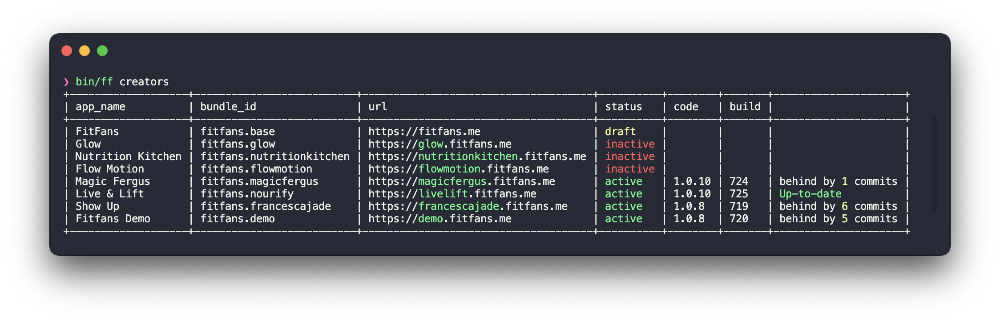

# flutterfy-cli
> Combination of `Flutter` + `Simplify`

<p align="center">
  
</p>

## Usage

```bash
f clean
# => Deep cleans the project and rebuilds it.
```

```bash
f fix
# => Automatically identifies and corrects common issues in Dart code, such as outdated syntax.
```

```bash
f fix
# => Automatically identifies and corrects common issues in Dart code, such as outdated syntax

```
```bash
f bump major|minor|patch|build
# => bumps the corresponding update type (and it always bumps the build number)
```

```bash
f generate swagger|icon|assets
# => swagger: Executes a function to generate a Swagger (OpenAPI) client.
# => icon: Generates the icons for the app.
# => assets: Initiates asset generation and management. (using "flutter_launcher_icons")
```

```bash
f open ios|android
# => ios: Opens the appstoreconnect website.
# => android: Opens the play console website.
```

```bash
f release beta|production
# => beta: Releases the current build to the beta track.
# => production: the current build to the production track.
```


## Nice to Have
- [ ] be able to list all the actions with some `f actions`